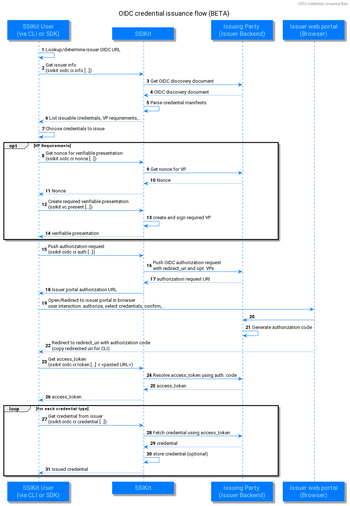
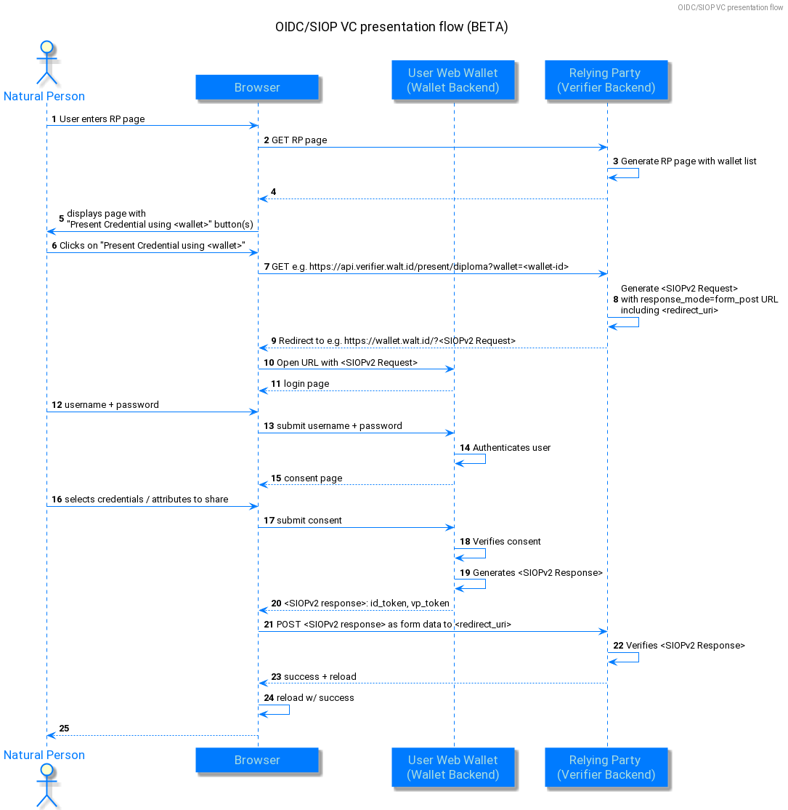

# OIDC - OpenID Connect for verifiable credential issuance and presentation

This section shows how the SSIKit can be used to interact with OpenID Connect identity providers for the exchange of verifiables credentials and presentation.

The SSIKit implements client-side functionality to receive credentials from an OIDC issuer, according to the **OIDC4CI** specification:

and to present credentials to an OIDC Verifier, according to the **OIDC4VP / SIOPv2** specification:

[**OIDC4VP - OIDC for verifiable presentations**](https://openid.net/specs/openid-connect-4-verifiable-presentations-1_0.html)

## OIDC for credential issuance

The SSIKit implements the OIDC credential issuance flow, allowing SDK and/or CLI users to get credentials issued from OIDC compliant issuers. 

The respective **OIDC4CI** specification can be found at:

[**OIDC4CI - OIDC for credential issuance**](https://tlodderstedt.github.io/openid-connect-4-verifiable-credential-issuance-1_0-01.html)

:::Refer also to our **web wallet documentation**, for an example of an actual end-to-end integration of the issuance flow.:::

## OIDC/SIOPv2 for verifiable presentations

