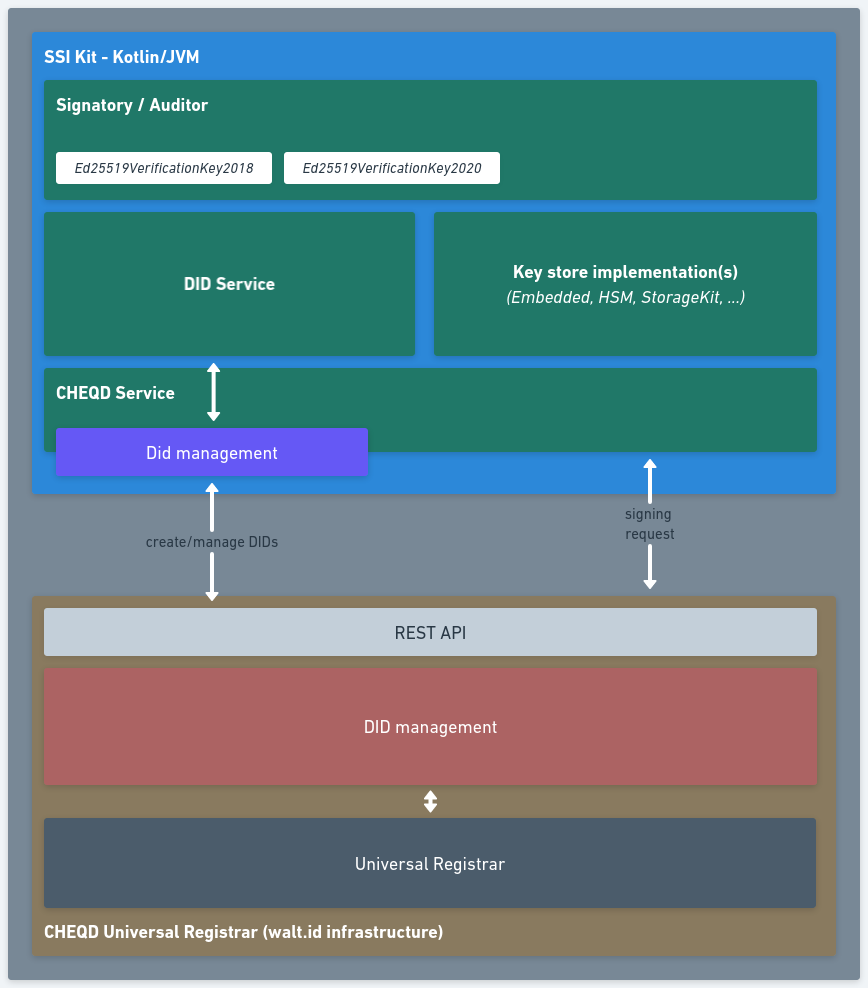

# Integration architecture

In order to be able to onboard the `did:cheqd` on testnet and mainnet, SSIKit relies on a [cheqd universal registrar](https://github.com/cheqd/did-registrar) deployed on walt.id infrastructure. The DID will be created using a key imported into or also created with SSIKit.

<figure><figcaption>
CHEQD architecture infrastructure
</figcaption></figure>
