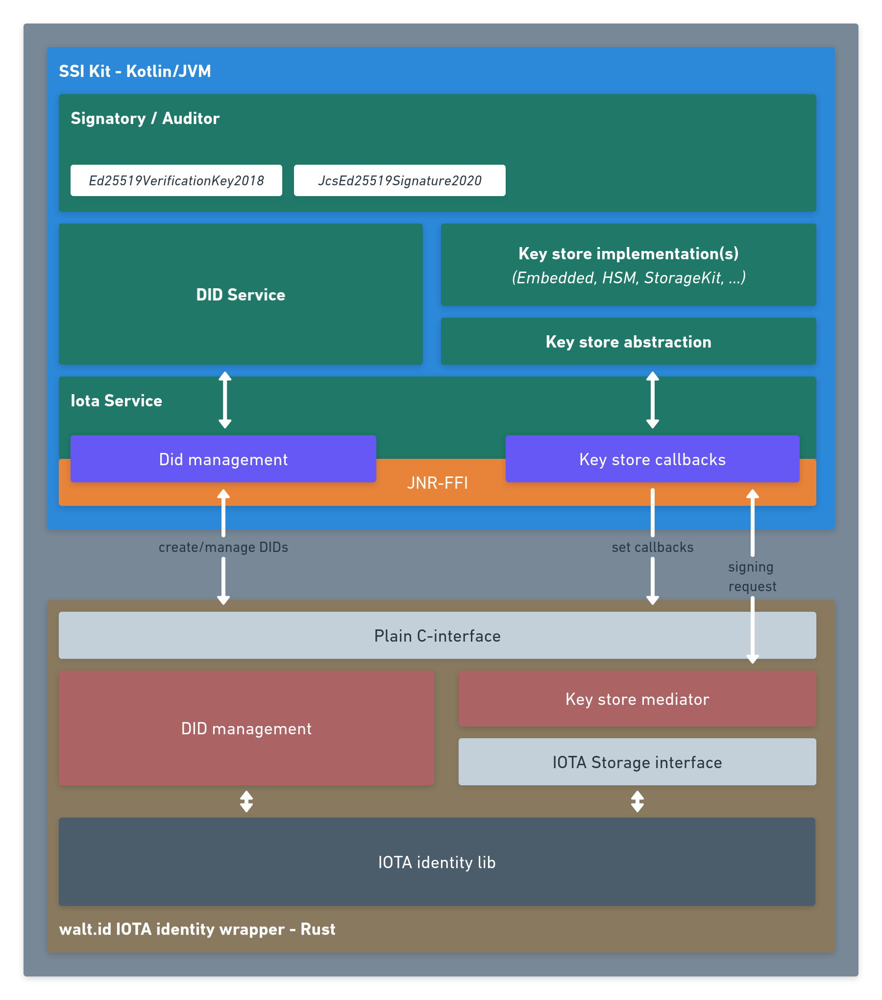

# IOTA


We apologize that our current implementation does not yet support the Stardust Upgrade from IOTA. As such, you cannot issue or verify credentials associated via a did:iota. Please refer to our [roadmap](https://walt-id.notion.site/fcde1687baab42378b3047d4a22eeaca?v=1140dd17c17b4726a70cc1465d20866d) for more information on when our products will be updated to include this latest changes.


The following section outlines the planned integration of the IOTA identity framework with the walt.id SSI Kit and gives insight on the architecture of the integration and the required changes that need to be applied to the SSI Kit to establish smooth interoperability with the IOTA ecosystem.

## Introduction

The [**IOTA identity framework**](https://wiki.iota.org/identity.rs/introduction), much like the walt.id SSI Kit, is based on open standards for decentralized identity, such as the **W3C** specifications for [verifiable credentials](https://www.w3.org/TR/vc-data-model/) and [decentralized identifiers (DIDs)](https://www.w3.org/TR/did-core/) and provides creation, management and registration of DIDs on the IOTA DLT technology (tangle), as well, as issuance, signing and validation of verifiable credentials.

In addition to the open standards for decentralized identity, the IOTA identity frameword implements a custom DID method, which needs to be supported by the walt.id SSI Kit to ensure compatibility.

## Integration overview

Thanks to the use of W3C standards for DID documents and verifiable credentials, the SSI Kit is mostly compatible with the IOTA identity framework, with regards to DID documents and issuance/validation of verifiable credentials. Also the key type _Ed25519_, used in the IOTA framework is already supported by the SSI Kit.

The following aspects have been identified, which require implementation changes and/or integration work in the SSI Kit:

1. **IOTA DID method**: Creation, management and registration of DIDs on the IOTA tangle
2. **Key management**: Integrate SSI Kit key management seamlessly, such that keys managed by the SSI Kit (or a supported key store implementation) can be leveraged in the context of the IOTA framework.
3. **Signature type**: To ensure compatibility of issued credentials with both the SSI Kit and the IOTA framework, the LD-signature type _JcsEd25519Signature2020_ needs to be supported in the SSI Kit.
4. **Public key format**: The public key, stored in the verification methods of the IOTA DID documents, is formatted in multibase encoding, for which support in the SSI Kit needs to be provided.

The following subsections give more details on the planned integration work.

## Integration architecture

The following chart outlines the overall architecture of the integration between the walt.id SSI Kit and the IOTA framework:

## Rust library wrapper

In order to overcome the native-to-managed-code gap between the IOTA identity framework libraries, written in Rust, and the SSI Kit in Kotlin/JVM, a wrapper library is implemented in Rust, which includes the IOTA libraries as a dependency and exposes a plain C-compatible application binary interface (ABI).

The wrapper library can be loaded in Kotlin/JVM using the [JNR-FFI](https://github.com/jnr/jnr-ffi) abstracted foreign function layer library. The advantage compared to JNI (Java Native Interface) is that no Java-specific interface code needs to be written in the native wrapper library, such that the same library could be used from various other programming and scripting languages, that support loading of native dynamic libraries.

This approach also facilitates portability of the wrapper library to all operating systems and platforms supported by the Rust compiler and the IOTA framework library.

## DID management

For DID creation and management, the wrapper library implements an interface method, called by the _IotaService_ component in the SSI Kit.

The public and private keys for creating the DID, should be managed by the SSI Kit and its key store abstraction layer, with support for various key store implementations (see also [Key management](./#key-management) below).

The wrapper library makes use of the _AccountBuilder_ of the _identity\_iota::account_ module to create and register a DID on the IOTA ledger. After creation the library updates the DID document to include the various [verification method relationships](https://www.w3.org/TR/did-core/#verification-relationships), such that issuance (_assertionMethod_) and presentation (_authentication_) of verifiable credentials is permitted using the new DID.

The created DID document is returned to the SSI Kit, where it can be parsed and stored for further use.

## Key management

In order to be able to make full use of the SSI Kit together with the IOTA framework, it is preferred to share the key store between both worlds.

The SSI Kit provides a key store abstraction layer, that has support for various key store implementations, including an embedded key store and cryptography library, as well as cloud-based HSM stores, such as Azure key vault and the walt.id Storage Kit, a general-purpose distributed encrypted data store.

In order to leverage the SSI Kit key store abstraction with the IOTA identity framework integration, we plan to implement a _key store mediator_ component in the Rust wrapper library, which exposes the IOTA [_storage interface_](https://wiki.iota.org/identity.rs/concepts/advanced/storage_interface) on the one hand, and, on the other hand, communicates the signing or encryption/decryption requests to the SSI Kit via a native-to-managed callback function. This _key store mediator_ can be passed to the _AccountBuilder_ as to storage interface to use for DID creation. The SSI Kit can then fulfill the cryptographic requests using the configured key store implementation and hand back the result to the wrapper library and IOTA framework internals.

## LD signature type

The IOTA identity framework makes use of the [_JcsEd25519Signature2020_](https://identity.foundation/JcsEd25519Signature2020/) LD-signature type for signing and validation of verifiable credentials.

Thus, to be compatible with the credentials issued by the IOTA framework,the SSI Kit needs to be extended to support this type of signature.

## DID documents and verification material

To make the SSI Kit compatible with the DID documents created by the IOTA identity framework, it is required to support _Multibase_ encoding of the verification material in the verification method objects, according to the latest [DID specification](https://www.w3.org/TR/did-core/#verification-material), as for the time being, an older version of said specification is implemented, using _Base58_ encoding.

Given the support of multibase encoded verification material, the DID documents should be fully compatible with the SSI Kit.
