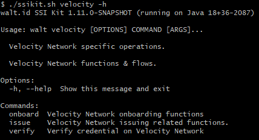

# Command line interface

This section describes the following functions implemented as part of Velocity network integration:
* [onboarding](./onboarding.md)
    * [tenant management](./onboarding.md#tenant-management)
    * [disclosure management](./onboarding.md#disclosure-management)
* [issuance](./issuance.md)
    * [offer management](./issuance.md#offer-management)
    * [credential management](./issuance.md#credential-management)
* [verification](./verification.md)

Velocity network specific operation are available under the `velocity` command:  
```
 ./ssikit.sh velocity -h
```

