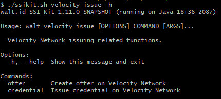
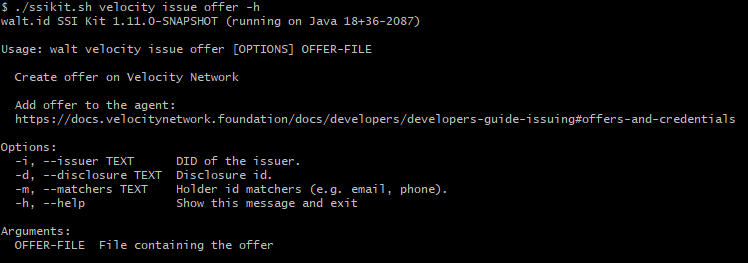
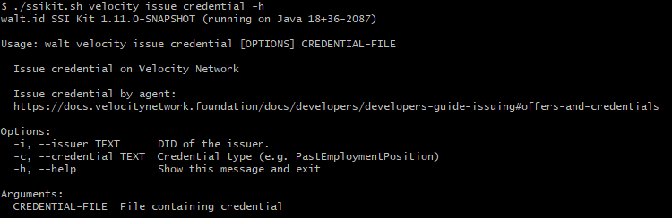

# Issuing

Velocity issuance commands are available under `issue` command as follows:

* offer management
* credential management

```
./ssikit.sh velocity issue -h
```



## Offer management

Before being able to issue verifiable credentials, the credential data needs to be prepared. Offers represent the way to set up credential data. Basically, an offer is a credential that has not been signed. The offer management functions can be accessed from the command:

```
./ssikit.sh velocity issue offer -h
```

Currently available functions are:

* create offer



E.g. Create an offer.

```
./ssikit.sh velocity issue -i did:velocity:0xd4df29726d500f9b85bc6c7f1b3c021f16305692 -d 61966dfc4732da2ea0e64826 -m adam.smith@example.com
```



```
{
    "type":
    [
        "PastEmploymentPosition"
    ],
    "credentialSubject":
    {
        "vendorUserId": "adam.smith@example.com",
        "company": "did:velocity:0xd4df29726d500f9b85bc6c7f1b3c021f16305692",
        "companyName":
        {
            "localized":
            {
                "en": "Microsoft Corporation"
            }
        },
        "title":
        {
            "localized":
            {
                "en": "Director, Communications (HoloLens & Mixed Reality Experiences)"
            }
        },
        "startMonthYear":
        {
            "month": 10,
            "year": 2010
        },
        "endMonthYear":
        {
            "month": 5,
            "year": 2022
        },
        "location":
        {
            "countryCode": "US",
            "regionCode": "MA"
        },
        "description":
        {
            "localized":
            {
                "en": "Big Data, AI, Hybrid, IoT, Datacenter, Mixed Reality/HoloLens, D365, Power Platform - all kinds of fun stuff!!!"
            }
        }
    },
    "offerCreationDate": "2020-08-04T21:13:32.019Z",
    "offerExpirationDate": "2021-08-04T21:13:32.019Z",
    "offerId": "ptIQrgxaicFX0QPVf_Z1L"
}
```



```
{
    "type":
    [
        "PastEmploymentPosition"
    ],
    "credentialSubject":
    {
        "vendorUserId": "adam.smith@example.com",
        "company": "did:velocity:0xd4df29726d500f9b85bc6c7f1b3c021f16305692",
        "companyName":
        {
            "localized":
            {
                "en": "Microsoft Corporation"
            }
        },
        "title":
        {
            "localized":
            {
                "en": "Director, Communications (HoloLens & Mixed Reality Experiences)"
            }
        },
        "startMonthYear":
        {
            "month": 10,
            "year": 2010
        },
        "endMonthYear":
        {
            "month": 5,
            "year": 2022
        },
        "location":
        {
            "countryCode": "US",
            "regionCode": "MA"
        },
        "description":
        {
            "localized":
            {
                "en": "Big Data, AI, Hybrid, IoT, Datacenter, Mixed Reality/HoloLens, D365, Power Platform - all kinds of fun stuff!!!"
            }
        }
    },
    "offerCreationDate": "2020-08-04T21:13:32.019Z",
    "offerExpirationDate": "2021-08-04T21:13:32.019Z",
    "offerId": "ptIQrgxaicFX0QPVf_Z1L",
    "id": "634d9aacb6b4b8ab66563fac",
    "createdAt": "2022-10-14T18:10:52.726Z",
    "updatedAt": "2022-10-14T18:10:52.726Z",
    "exchangeId": "634d9a9caa4dc9cf44a8f37f",
    "issuer":
    {
        "id": "did:velocity:0x6872fedef46b03e9863a56859a1cdb45648907f7"
    }
}
```



## Credential management

Credential management functions include:

* issue credential

```
./ssikit.sh velocity issue credential -h
```



E.g. Issue credential.

```
./ssikit.sh velocity issue credential -i did:velocity:0x6872fedef46b03e9863a56859a1cdb45648907f7 -c PastEmploymentCredential credential-data.json
```



```
{
    "type":
    [
        "PastEmploymentPosition"
    ],
    "credentialSubject":
    {
        "vendorUserId": "adam.smith@example.com",
        "company": "did:velocity:0xd4df29726d500f9b85bc6c7f1b3c021f16305692",
        "companyName":
        {
            "localized":
            {
                "en": "Microsoft Corporation"
            }
        },
        "title":
        {
            "localized":
            {
                "en": "Director, Communications (HoloLens & Mixed Reality Experiences)"
            }
        },
        "startMonthYear":
        {
            "month": 10,
            "year": 2010
        },
        "endMonthYear":
        {
            "month": 5,
            "year": 2022
        },
        "location":
        {
            "countryCode": "US",
            "regionCode": "MA"
        },
        "description":
        {
            "localized":
            {
                "en": "Big Data, AI, Hybrid, IoT, Datacenter, Mixed Reality/HoloLens, D365, Power Platform - all kinds of fun stuff!!!"
            }
        }
    },
    "offerCreationDate": "2020-08-04T21:13:32.019Z",
    "offerExpirationDate": "2021-08-04T21:13:32.019Z",
    "offerId": "ptIQrgxaicFX0QPVf_Z1L"
}
```



```
velocity-network://issue?request_uri=https://stagingagent.velocitycareerlabs.io/api/holder/v0.6/org/did:velocity:0x6872fedef46b03e9863a56859a1cdb45648907f7/issue/get-credential-manifest?exchange_id=634d9a9caa4dc9cf44a8f37f&credential_types=PastEmploymentPosition
```


