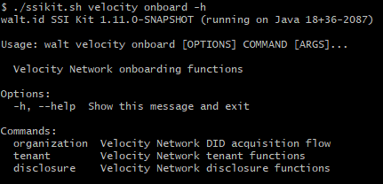
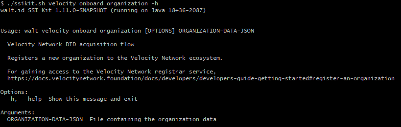
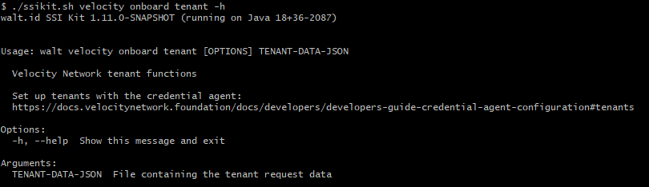
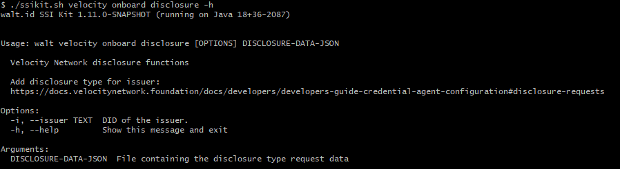

# Onboarding

Velocity onboading commands are available under the `onboard` command as follows:

* [DID acquisition](onboarding.md#did-acquisition)
* [tenant management](onboarding.md#tenant-management)
* [disclosure management](onboarding.md#disclosure-management)

```
./ssikit.sh velocity onboard -h
```



## DID acquisition

Once an account was set up with the registrar (see [onboarding](../basics/onboarding.md)), cli-tool can be used to register the organization, using the command:

```
./ssikit.sh velocity onboard organization <org-file>
```



E.g. Onboarding organization.

```
./ssikit.sh velocity onboard organization organization.json
```



```
{
    "profile":
    {
        "name": "WaltID",
        "location":
        {
            "countryCode": "AT",
            "regionCode": "W"
        },
        "founded": "2021",
        "logo": "https://images.squarespace-cdn.com/content/v1/609c0ddf94bcc0278a7cbdb4/d7a7bc88-c700-4efe-a95f-8d3086bccb9d/Walt.id_Logo_round.png?format=1500w"
    },
    "serviceEndpoints":
    [
        {
            "id": "#credential-agent-operator-1",
            "serviceEndpoint": "https://agent.velocity.walt.id",
            "type": "VlcCredentialAgentOperator_v1"
        },
        {
            "id": "#credential-agent-inspector-1",
            "serviceEndpoint": "https://agent.velocity.walt.id",
            "type": "VlcInspector_v1"
        },
        {
            "id": "#credential-agent-issuer-1",
            "serviceEndpoint": "https://agent.velocity.walt.id",
            "type": "VlcCareerIssuer_v1",
            "credentialTypes":
            [
                "OpenBadgeCredential",
                "EducationDegree",
                "CurrentEmploymentPosition",
                "PastEmploymentPosition",
                "Badge",
                "Certification",
                "Course",
                "Assessment",
                "AssessmentDec2020",
                "VaccinationCertificate-Apr2021",
                "CourseRegistrationV1.0",
                "CourseCompletionV1.0",
                "CourseAttendanceV1.0",
                "EducationDegreeRegistrationV1.0",
                "EducationDegreeStudyV1.0",
                "EducationDegreeGraduationV1.0",
                "CertificationV1.0",
                "LicenseV1.0",
                "OpenBadgeV1.0",
                "AssessmentV1.0",
                "EmploymentCurrentV1.0",
                "EmploymentPastV1.0",
                "VerifiableCredential",
                "ComprehensiveLearnerRecord",
                "CourseRegistrationV1.1",
                "CourseCompletionV1.1",
                "CourseAttendanceV1.1",
                "EducationDegreeRegistrationV1.1",
                "EducationDegreeStudyV1.1",
                "EducationDegreeGraduationV1.1",
                "CertificationV1.1",
                "LicenseV1.1",
                "AssessmentV1.1",
                "EmploymentCurrentV1.1",
                "EmploymentPastV1.1",
                "BadgeV1.1",
                "OpenBadgeV2.0",
                "OpenBadgeV2.1"
            ]
        }
    ]
}
```



```
{
    "id": "did:ion:org-did",
    "didDoc":
    {
        "@context":
        [
            "https://www.w3.org/ns/did/v1",
            {
                "@base": "<did:ion:org-did>"
            }
        ],
        "id": "<did:ion:org-did>",
        "verificationMethod":
        [
            {
                "id": "#vc-signing-key-1",
                "type": "EcdsaSecp256k1VerificationKey2019",
                "controller": "",
                "publicKeyJwk":
                {
                    "crv": "secp256k1",
                    "x": "<x-value>",
                    "y": "<y-value>",
                    "kty": "EC"
                }
            },
            {
                "id": "#eth-account-key-1",
                "type": "EcdsaSecp256k1VerificationKey2019",
                "controller": "",
                "publicKeyJwk":
                {
                    "crv": "secp256k1",
                    "x": "<x-value>",
                    "y": "<y-value>",
                    "kty": "EC"
                }
            },
            {
                "id": "#exchange-key-1",
                "type": "EcdsaSecp256k1VerificationKey2019",
                "controller": "",
                "publicKeyJwk":
                {
                    "crv": "secp256k1",
                    "x": "<x-value>",
                    "y": "<y-value>",
                    "kty": "EC"
                }
            }
        ],
        "assertionMethod":
        [
            "#vc-signing-key-1",
            "#eth-account-key-1",
            "#exchange-key-1"
        ],
        "service":
        [
            {
                "type": "VlcCredentialAgentOperator_v1",
                "id": "#credentialagent-1",
                "serviceEndpoint": "https://agent.samplevendor.com/acme"
            },
            {
                "type": "VlcCareerIssuer_v1",
                "id": "#issuer-1",
                "serviceEndpoint": "https://agent.samplevendor.com/acme",
                "credentialTypes":
                [
                    "CertificationV1.1",
                    "LicenseV1.1",
                    "CourseCompletionV1.1",
                    "EducationDegreeGraduationV1.1",
                    "EmploymentCurrentV1.1",
                    "EmploymentPastV1.1"
                ]
            },
            {
                "type": "VlcInspector_v1",
                "id": "#inspector-1",
                "serviceEndpoint": "https://agent.samplevendor.com/acme"
            }
        ]
    },
    "profile":
    {
        "name": "Test Organization",
        "location":
        {
            "countryCode": "US",
            "regionCode": "NY"
        },
        "logo": "https://images.squarespace-cdn.com/content/v1/609c0ddf94bcc0278a7cbdb4/d7a7bc88-c700-4efe-a95f-8d3086bccb9d/Walt.id_Logo_round.png?format=1500w",
        "website": "http://www.organization.com",
        "cntactEmail": "contact@example.com",
        "founded": "2021-01-01",
        "registrationNumbers":
        [
            {
                "authority": "DunnAndBradstreet",
                "number": "1",
                "uri": "uri://uri"
            }
        ],
        "id": "<did:ion:org-did>",
        "verifiableCredentialJwt": "http://registrar.velocitynetwork.foundation/api/v0.6/organizations/<did:ion:org-did>/resolve-vc/<token>",
        "permittedVelocityServiceCategory":
        [
            "CredentialAgentOperator",
            "Issuer",
            "Inspector"
        ]
    },
    "keys":
    [
        {
            "id": "#vc-signing-key-1",
            "purposes":
            [
                "ISSUING_METADATA"
            ],
            "key": "<key-value>",
            "publicKey": "<key-value>",
            "algorithm": "SECP256K1",
            "encoding": "hex",
            "controller": "<did:ion:org-did>"
        },
        {
            "id": "#eth-account-key-1",
            "purposes":
            [
                "DLT_TRANSACTIONS"
            ],
            "key": "<key-value>",
            "publicKey": "<key-value>",
            "algorithm": "SECP256K1",
            "encoding": "hex",
            "controller": "<did:ion:org-did>"
        },
        {
            "id": "#exchange-key-1",
            "purposes":
            [
                "EXCHANGES"
            ],
            "key": "<key-value>",
            "publicKey": "<key-value>",
            "algorithm": "SECP256K1",
            "encoding": "hex",
            "controller": "<did:ion:org-did>"
        }
    ],
    "authClients":
    [
        {
            "type": "auth0",
            "clientType": "cao-node-client",
            "clientId": "<id-value>",
            "clientSecret": "<secret-value>",
            "serviceId": "#credentialagent-1"
        }
    ]
}
```



## Tenant management

Every organization needs a tenant on the credential agent. Tenant functions are available under the `tenant` command:

* create tenant

```
./ssikit.sh velocity onboard tenant -h
```



E.g. Add a tenant having verifier, issuer and agent operator purposes.

```
./ssikit.sh velocity onboard tenant tenant.json
```



```
{
    "serviceIds":
    [
        "#credential-agent-operator-1",
        "#credential-agent-inspector-1",
        "#credential-agent-issuer-1"
    ],
    "did": "<did:ion:org-did>",
    "keys":
    [
        {
            "purposes":
            [
                "DLT_TRANSACTIONS"
            ],
            "algorithm": "SECP256K1",
            "encoding": "hex",
            "kidFragment": "#eth-account-key-1",
            "key": "<key-value>"
        },
        {
            "purposes":
            [
                "EXCHANGES"
            ],
            "algorithm": "SECP256K1",
            "encoding": "hex",
            "kidFragment": "#exchange-key-1",
            "key": "<key-value>"
        },
        {
            "purposes":
            [
                "ISSUING_METADATA"
            ],
            "algorithm": "SECP256K1",
            "encoding": "hex",
            "kidFragment": "#vc-signing-key-1",
            "key": "<key-value>"
        }
    ]
}
```



```
{
    "id": "634d9327aa4dc9cf44a8f37a",
    "createdAt": "2022-10-14T17:38:47.231Z"
}
```



## Disclosure management

In order to be able to issue / verify credential, it is required to have the correct identification disclosure set up. Current disclosure management functions are:

* create disclosure

```
./ssikit.sh velocity onboard disclosure -h
```



E.g. Create an integrated issuing identification disclosure.

```
./ssikit.sh velocity onboard disclosure -i did:ion:1234567890 disclosure.json
```



```
{
    "types":
    [
        {
            "type": "EmailV1.0"
        }
    ],
    "vendorEndpoint": "integrated-issuing-identification",
    "vendorDisclosureId": "MSFT0001",
    "purpose": "Id Check",
    "duration": "16m",
    "termsUrl": "https://www.velocityexperiencecenter.com/terms-and-conditions-vnf",
    "activationDate": "2021-02-16T00:00:01Z",
    "identityMatchers":
    {
        "vendorUserIdIndex": 0,
        "rules":
        [
            {
                "valueIndex": 0,
                "path":
                [
                    "$.emails"
                ],
                "rule": "pick"
            }
        ]
    }
}
```



```
{
    "types":
    [
        {
            "type": "EmailV1.0"
        }
    ],
    "vendorDisclosureId": "MSFT0001",
    "vendorEndpoint": "integrated-issuing-identification",
    "identityMatchers":
    {
        "rules":
        [
            {
                "path":
                [
                    "$.emails"
                ],
                "rule": "pick",
                "valueIndex": 0
            }
        ],
        "vendorUserIdIndex": 0
    },
    "purpose": "Id Check",
    "duration": "16m",
    "termsUrl": "https://www.velocityexperiencecenter.com/terms-and-conditions-vnf",
    "activationDate": "2021-02-16T00:00:01.000Z",
    "id": "634d9625b6b4b8ab66563fab",
    "createdAt": "2022-10-14T17:51:33.769Z",
    "updatedAt": "2022-10-14T17:51:33.769Z"
}
```


