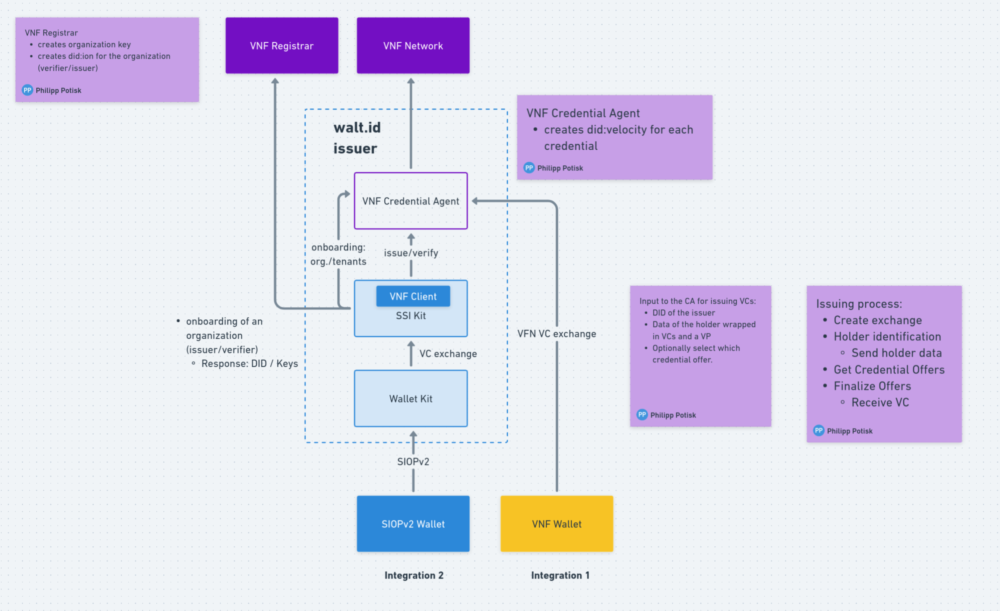

# Integration with SSIKit

The interaction with Velocity network is implemented in SSIKit using a Rest API client which currently exposes the functionality through the command-line-interface. The available functions can grouped as follows:

* organization related
  * onboarding
  * tenant configuration
* credential related
  * issuance
  * verification

In order to cover the credential related functions, but also tenant management, SSIKit uses a credential agent deployed on _walt.id_ infrastructure. For this, _walt.id_ is registered on Velocity network (currently only on testnet) as a credential agent operator and can issue and verify credentials on behalf of issuer using either issuer's keys or _walt.id_ keys. The diagram below shows how Velocity integration is currently done with SSIKit.

The organization related functions, such as onboarding and DID acquisition, are implemented by calling Velocity network registrar Rest API.
