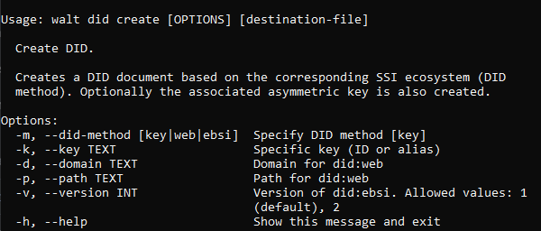

# Decentralized Identifiers

DID related operations, like registering, updating and deactivating DIDs.

Commands:&#x20;

* [Create DID](decentralized-identifiers.md#create-did) - using **create** command.&#x20;
* [Resolve DID](decentralized-identifiers.md#resolve-did) - using **resolve** command.
* [List DIDs](decentralized-identifiers.md#list-dids) - using **list** command.
* [Import DID](decentralized-identifiers.md#import-did) to custodian store - using **import** command.
* [Delete DID](decentralized-identifiers.md#delete-did) from custodian - using **delete** command.

All commands have the help option available:

* `<your-command> -h`&#x20;
* `<your-command> --help`

E.g. `did create -h`

### Create DID

Creates a DID document using `did create [options]` command based on the corresponding SSI ecosystem (DID method). Optionally the associated asymmetric key is also created.

#### Options

* `-m, --did-method [key | web | ebsi | iota | jwk | cheqd]` - Specify DID method \[key], Supported DID methods are: "key", "web", "ebsi", "iota", "jwk"
* `-k, --key TEXT` - Specific key (ID or alias)
* `-d, --domain TEXT` - Domain for did:web
* `-p, --path TEXT` - Path for did:web
* `-v, --version INT` - Version of did:ebsi. Allowed values: 1 (default), 2.

The returned value represents the DID document.

E.g. `did create -m ebsi -k 8a2c3628acdd45999b4c0b5a69911437`&#x20;

.PNG>)


**IOTA support**

For creating IOTA DIDs and registering them on the IOTA tangle, a wrapper library needs to be installed and available in the local library path.

The wrapper library is included in the SSIKit Docker image, such that for Docker users no additional setup is required.

CLI users can find instructions for build and SSIKit integration at:

[https://github.com/walt-id/waltid-iota-identity-wrapper](https://github.com/walt-id/waltid-iota-identity-wrapper)


### Resolve DID

Resolves the DID document.

Options:&#x20;

\-d, --did TEXT DID to be resolved&#x20;

\-r, --raw / -t, --typed&#x20;

\-w, --write

### List DIDs

List all created DIDs using `did list` command

.png>)

### Import DID

Import DID to custodian store using `did import [options]` command

#### Options

* `-k, --key-id TEXT` - Specify key ID for imported did, if left empty, only public key will be imported
* `-f, --file TEXT` - Load the DID document from the given file
* `-d, --did TEXT` - Try to resolve DID document for the given DID

### Delete DID

Use the `delete` command to delete a DID:

* `did delete <your did>`

E.g. `did delete -d "did:ebsi:zs79GYJvzEnQYxkAAj4UX1j"`

 (1).png>)
