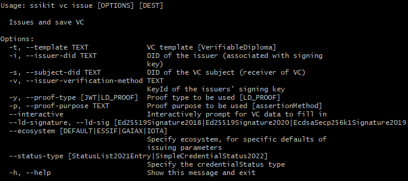

# Verifiable Credentials

VC related operations like issuing, verifying and revoking VCs. If you're new to VCs, check out the [intro section](../../ssi-kit/what-is-ssi/technologies-and-concepts/verifiable-credentials-vcs-and-verifiable-presentations-vps.md) for an overview.

Commands:

* [Issues and save VC](verifiable-credentials.md#issue-and-save-vc) - using **issue** command
* [Present VC](verifiable-credentials.md#present-vc) - using **present** command
* [Verify VC or VP](verifiable-credentials.md#verify-vc-or-vp) - using **verify** command
* [List verification policies](verifiable-credentials.md#list-verification-policies) - using **policies** command
* [Import VC to custodian store](verifiable-credentials.md#import-vc-to-custodian-store) - using **import** command
* [VC templates](verifiable-credentials.md#vc-templates) - using **templates** command
* [List VCs](verifiable-credentials.md#list-vcs) - using **list** command

All commands have the help option available:

* `<your-command> -h`
* or `<your-command> --help`

E.g. `vc issue -h`



### Issue and save VC

Use the `issue` command to issue a W3C Verifiable Credential with either a JWT or a JSON\_LD signature.

options:

* `-t, --template TEXT` specify the VC template. To create your own template, have a look [here](verifiable-credentials.md#import-vc-template-to-custodian-store) \[Required]
* `-i, --issuer-did TEXT` DID of the issuer (associated with signing key). \[Required]
* `-s, --subject-did TEXT` DID of the VC subject (receiver of VC). \[Required]
* `-v, --issuer-verification-method TEXT` KeyId of the issuers' signing key
* `-y, --proof-type [JWT|LD_PROOF]` Proof type to be used \[LD\_PROOF]
* `-p, --proof-purpose TEXT` Proof purpose to be used \[assertion]
* `--interactive` Interactively prompt for VC data to fill in
* `--ld-signature, --ld-sig \[Ed25519Signature2018|Ed25519Signature2020|EcdsaSecp256k1Signature2019|RsaSignature2018|JsonWebSignature2020|JcsEd25519Signature2020]`
* `--ecosystem \[DEFAULT|ESSIF|GAIAX|IOTA]` Specify ecosystem, for specific defaults of issuing parameters
* `--statusType \[StatusList2021Entry|SimpleCredentialStatus2022]` specify the _credentialStatus_ type

e.g.

* `vc issue -t OpenBadgeCredential -s did:key:z6MkpuUYdpaZPcpnEWnkE8vb7s2u2geTZJden1BwGXsdFUz3 -i did:ebsi:zZ5apnsHPUXNqjWELjNZhYW`, returns a credential document (JSON format)

.png>)

### Present VC

Use present command to present a VC or VP to a verifier.

`-i, --holder-did TEXT` DID of the holder (owner of the VC)

`-v, --verifier-did TEXT` DID of the verifier (recipient of the VP)

`-d, --domain TEXT` Domain name to be used in the LD proof

`-c, --challenge TEXT` Challenge to be used in the LD proof

### Verify VC or VP

use verify command to verify

`-p, --policy VALUE` Verification policy. Can be specified multiple times. By default, SignaturePolicy is used. For more details on how to specify the policies, refer to [verification-policies.md](../../usage-examples/verifiable-credentials/verification-policies.md "mention").

### List verification policies

To see available verification policies, use `vc policies` command

.png>)

### Import VC to custodian store

Import VC to custodian store

### VC templates

Learn about VC template related functions like the listing and exporting of templates, as well as how to create/import your own custom VC template.

* `list` List VC Templates.

`vc template list` result

.png>)

* `export <template-name>` Export VC Template.

e.g. `vc templates export VerifiableId`

.png>)

#### Import VC template to custodian store

* `import <customCredentialPath.json>`

Options:

* `-n, --name <Name>` Name of the template

Arguments:

* `credential path` the last argument of the command references the path to the custom credential, which should be imported

e.g `vc templates import -n MyCustomCredential custom.json`

**custom.json**

```json
{
  "type": [
    "VerifiableCredential",
    "MyCustomCredential" // name of the credential
  ],
  "@context": [
    "https://www.w3.org/2018/credentials/v1",
    "https://www.w3.org/2018/credentials/examples/v1"
  ],
  "id": "http://example.gov/credentials/3732",
  "issuer": {
    "id": "did:example:456"
  },
  "issued": "2020-03-10T04:24:12.164Z",
  "credentialSubject": { //custom credential subject
    "id": "",
    "firstName": "",
    "lastName": "",
    "country": "Austria"
  }
}

```

**Output of the command**

<figure><figcaption></figcaption></figure>

### List VCs

* `list` VCs saved in the custodian store

e.g. `vc list`

<figure><figcaption></figcaption></figure>
