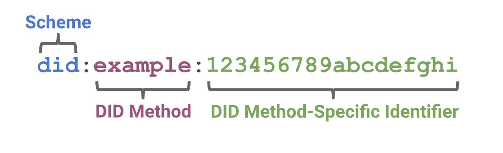
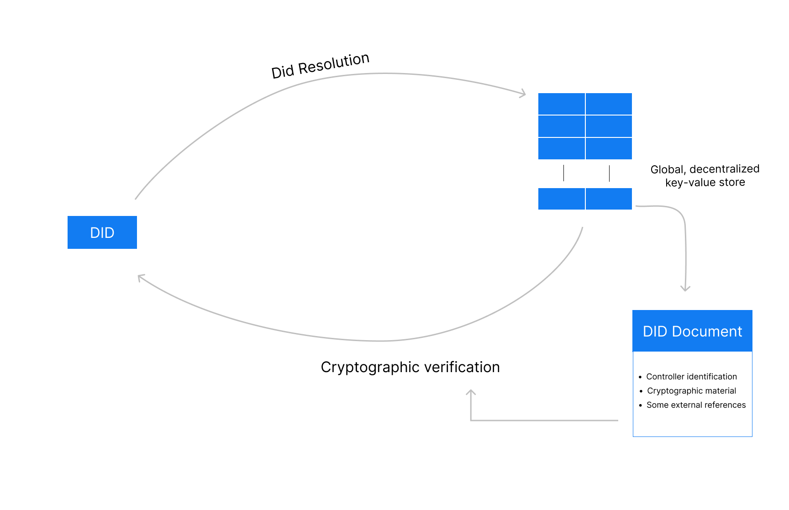

# Decentralised Identifiers (DIDs)

DIDs are **unique identifiers** (URIs) which are standardised by the [W3C](https://www.w3.org/TR/did-core). They can refer to any subject - from a person, to an organization, to a thing or basically anything else for that matter. Before we have a look at how a DID is structured and the benefit it provides, let's understand the shortcomings of current identifiers first and then see how the DID solves those.

### The shortcomings of current IDs

In the digital economy, data exchange happens a lot, which makes it increasingly important to be able to identify persons, concepts or anything else for that matter in a secure and verifiable way.&#x20;

A person today can have multiple different identifiers, like:

* name@surname.com
* https://www.surname.com
* 0000-0000-0000-0000 (ORCID based identifier, used to identify authors of scholarly communication)

All of these identifiers work, but none fulfills to be decentralized, persistent, resolvable and cryptographically verifiable when put into the following questions.

**Is the identifier decentralized?**

* `https://www.surname.com`depends on a single point of failure. What happens if the hosting side disappears?
* `0000-0000-0000-0000 (ORCID)` depends on the ORCID database. What happens if it is discontinued, hacked, etc?

**Is the identifier persistent?**

* `https://www.surname.com` If I do no longer pay for that domain, the identifier will be gone or even bought by somebody else.

**Is the identifier resolvable?**

* How can I get additional information about `0000-0000-0000-0000 (ORCID)` identifiers?

**Is  the identifier verifiable?**

* How can I prove that I own the domain, `https://www.surname.com`?
* If I stopped paying for my domain, `https://www.surname.com` __ and somebody else would buy it. How would somebody know that the information provided on the side was actually mine?

All those problems make it hard to be 100% sure when exchanging information, that the party we are exchanging information with, is actually the party and not some malicious actor pretending to be the party.

### **DID to the rescue**

The design of DIDs, which is a new form of unique identifier that has been standardized by the W3C, can now help us address these problems of current identifiers, by being:

**Decentralized**

* The DIDs no longer depend on centralized registries, identity providers, authorities, etc.

**Persistent**

* Once created, the did is permanently assigned to the subject.

**Resolvable**

* It is possible to find a basic set of information when resolving the did. Typically, this will lead to a DID Document.

**Cryptographically verifiable**

* There is a mechanism to cryptographically prove identity and ownership via information provided by the DID Document.


#### **DID format:**

The DID is a simple text string built up of three parts:&#x20;



| Schema                         | The did **** URI scheme identifier                        |   |
| ------------------------------ | --------------------------------------------------------- | - |
| DID Method                     | The identifier for the did method                         |   |
| DID Method-Specific Identifier | An identifier based on the requirements of the did method |   |

&#x20;

A variety of “**DID methods**'', which are different implementations of the DID specification, exist. Considering that DID methods differ in terms of how they are created, registered and resolved, different methods come with different advantages and disadvantages.&#x20;

For example, while DIDs are often anchored on Registries, such as EBSI (did:ebsi) or the Domain Name Service (did:web), new methods emerged that do not require Registries because their distribution is based on peer-to-peer interactions (e.g. did:key).

Now we can take any did, look at the method and resolve it based on the framework around the method. The resolved content will most of the time be **JSON** or **JSON-LD**, although other data formats might also be added in the future. The resolved contented is called **DID Document**.&#x20;


### **DID Document**

A container of information holding:

**The Subject**&#x20;

* The owner of the DID Document&#x20;

**The Controllers**

* The entities allowed to introduce changes to the DID Document. The controller may or may not be identical to the "subject". For example, if the DID Document belonged to a DID of a book. The controller would be the author or another related person, rather than the book itself.

**Cryptographic data**

* RSA, various elliptical curve keys, etc. (public keys). Those can be expressed using JWT or with DID specific terms and which will be used for authentication, verification or other use cases which would utilize public keys.

**Service endpoints**

* Services that the subject wants to mention

### DID general flow



### Example  (did:ebsi)

The identifier _<mark style="color:blue;">`did`</mark>`:`<mark style="color:purple;">`ebsi`</mark>`:`<mark style="color:green;">`2A9RkiYZJsBHT1nSB3HZAwYMNfgM7Psveyodxrr8KgFvGD5y`</mark>_ of the method **ebsi** would resolve to the following DID document:

```json
{
    "@context": [
        "https://w3id.org/did/v1"
    ],
    // keys used for the authentication of the contoller
    "authentication": [
        "did:ebsi:2A9RkiYZJsBHT1nSB3HZAwYMNfgM7Psveyodxrr8KgFvGD5y#1a7514b2d58141c3982021a6323b99bf"
    ],
    // the subject
    "id": "did:ebsi:2A9RkiYZJsBHT1nSB3HZAwYMNfgM7Psveyodxrr8KgFvGD5y",
    // the cryptographic data used for authentication, verification or other use cases
    // utilizing public keys
    "verificationMethod": [{
        "controller": "did:ebsi:2A9RkiYZJsBHT1nSB3HZAwYMNfgM7Psveyodxrr8KgFvGD5y",
        "id": "did:ebsi:2A9RkiYZJsBHT1nSB3HZAwYMNfgM7Psveyodxrr8KgFvGD5y#1a7514b2d58141c3982021a6323b99bf",
        "publicKeyJwk": {
            "alg": "EdDSA",
            "crv": "Ed25519",
            "kid": "1a7514b2d58141c3982021a6323b99bf",
            "kty": "OKP",
            "use": "sig",
            "x": "tqJADByHRU3YxswewQD4wQYXU9tB43j3PfjofsYEvqs"
        },
        "type": "Ed25519VerificationKey2018"
    }]
}
```



aOur open source products enable you to use different DID methods for different identity ecosystems. Every relevant functionality (e.g. generation, anchoring, resolution) is supported .

