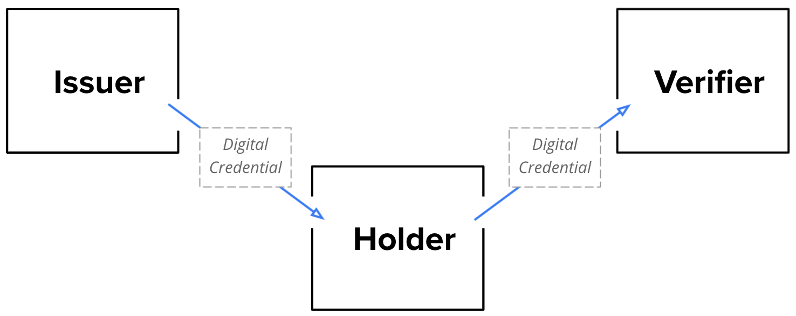
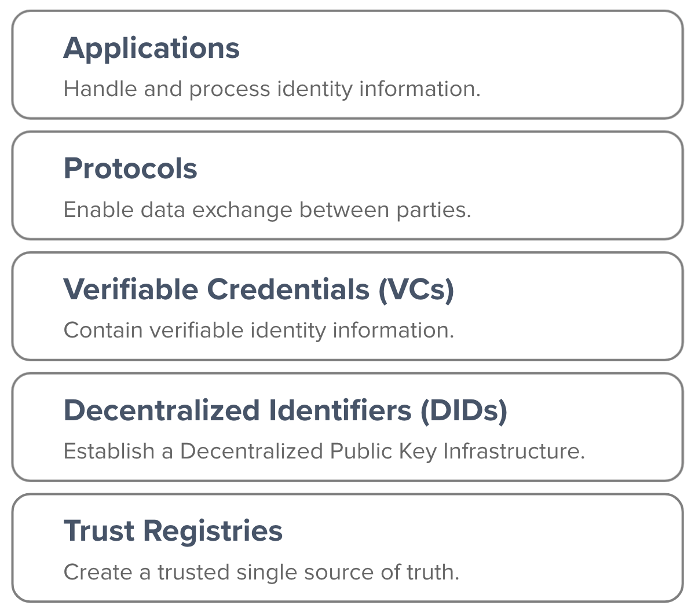

# SSI - Self-Sovereign Identity

## What is Self-Sovereign Identity (SSI)?
SSI is a __new approach towards digital identity__ that promises individuals and organisations full control over their data and enables them to share it freely with others who can then reliably verify data in a privacy-preserving fashion.  

At its core, Self-Sovereign Identity (SSI) is about the __exchange of verifiable identity data in a decentralised ecosystem that enables anyone to easily and reliably prove their identity, i.e. who they are and anything about them__ (e.g. age, address, diplomas, work records, vaccination records, financial information, health insurance, …).

On a high-level, we can distinguish three different roles a party can play:

- __Holder__ - A party who controls and shares its identity data.
- __Issuer__ - A party who “issues” identity data to a Holder.
- __Verifier__ - A party who verifies identity data presented by a Holder.

_Illustration:_


Usually, a single party plays only one of these roles per interaction. However, it is perfectly normal for a party to take on different roles in different interactions. For example:
- A university (Holder) is being accredited to issue certain types of educational credentials by a national authority (Issuer).
- A university (Issuer) issues a digital diploma to a graduate (Holder), who can share this information with a recruiter (Verifier) in the course of a job application.
- After the recruiting process, a recruiter (Issuer) issues the results of an applicant’s assessment (e.g. skills, referral) to the applicant (Holder), who can share this information with a new manager or another recruiter (Verifier).
- A manager (Issuer) issues the results of a performance review to his employee (Holder) who can share this information with HR (e.g. to improve talent development programs).

You can read more about SSI in our __Knowledge Base__.

## Concepts & Technologies

### Overview

Self-Sovereign Identity (SSI) combines a number of novel technologies and concepts. The result is a __multi-layered technology stack__:

1. __Registries__ create a single source of truth (for an identity ecosystem).
2. __Decentralised Identifiers (DIDs)__ establish a Decentralised Public Key Infrastructure (DPKI) used for discovery, authentication and encryption.
3. __Verifiable Credentials (VCs)__ and __Verifiable Presentations (VPs)__ contain actual identity data (e.g. name, age, diplomas, …) used for authentication and identification.
4. __Protocols__ enable the exchange of data, particularly of VCs/VPs, between different parties.
5. __Applications__ integrate SSI to provide value to end-users.

_Illustration:_


### Registries

Registries serve as a __single source of truth__ in which all participants of an SSI-based identity ecosystem can trust. Depending on the ecosystem, registries make certain information accessible to either anyone or just a limited group.
This building block is important because it enables:

- __Distributed Public Key Infrastructures (DPKIs)__ which create an open distribution system for public keys which can be used for encryption and authentication.
- __Trust Registries__ which contain reliable information about people, organisations and digital credentials (e.g. data models, status and validity information) to ensure that different parties can trust each other and the identity-related data they exchange.

Different technologies can be used to serve as registries. For example:
- __Blockchains__: Typically blockchains are used to establish registries, because it is unfeasible (or even impossible) to temper with them. The fact that no single organisation can simply change the contents of a blockchain or manipulate the terms by which it is governed are very aligned with the requirements for identity ecosystems.
  Today, we see more and more developers and organisations focusing on so-called public or private permissioned blockchains (i.e. only a selected group can “write”) like Ethereum Quorum/Enterprise or Hyperledger Indy/Fabric. Permissionless blockchains, like Bitcoin, are still used, but less than the permissioned alternatives for a variety of reasons like scalability, costs, lack of customisable governance frameworks.
- __Sidetrees__: Sidetrees are so-called Layer 2 networks that sit on top of blockchains and aggregate data before anchoring it. The main idea behind Sidetrees is to circumvent common challenges of public, permissionless blockchains like scalability and cost issues. The most popular implementations are “ION” (for Bitcoin) and “Element” (for Ethereum).
- __Other Distributed Ledger Technologies (DLTs)__: Sometimes other DLTs are utilised like the Interplanetary File System (IPFS) though its use for digital identity remains limited.
- __Domain Name Service (DNS)__: Considering certain drawbacks of DLTs and their relatively slow adoption by the mass market, DNS can also be used to serve as a registry. Though it is not fully decentralised (considering its underlying governance framework) DNS has many advantages like its maturity and global adoption.

Note that SSI can be implemented without registries, particularly without blockchains, because identity data (or at least personal data of individuals) is never anchored due to privacy and compliance reasons. However, by combining SSI with blockchains (or other technologies), robust and trustworthy identity ecosystems that utilise transparent DPKIs and reliable Trust Registries can emerge.

### Decentralised Identifiers (DIDs)

DIDs are unique identifiers (URIs) which are globally standardised by the [W3C](https://www.w3.org/TR/did-core). They are usually linked to so-called "DID Documents" which contain not only DIDs, but also metadata like keys, service endpoints or signatures and proofs.

DIDs are important because they establish a Distributed Public Key Infrastructure (DPKI) and allow parties to find each other (discovery), authenticate, encrypt and verifiably sign data.

Today, a variety of so-called “DID methods'', i.e. different implementations of the DID specification, exist. Considering that each DID method differs in terms of how it is created, registered and resolved, different methods come with different advantages and disadvantages. For example, while DIDs are traditionally anchored on registries, like blockchains (e.g. did:ebsi) or DNS (e.g. did:web), new methods emerged that do not require such registries because their distribution mechanism is based on peer-to-peer interactions (e.g. did:key, did:peer).

As example the identifier _did:ebsi:2A9RkiYZJsBHT1nSB3HZAwYMNfgM7Psveyodxrr8KgFvGD5y_ of the method __did:ebsi__ would resolve to the following DID document:
``` json
{
    "@context": [
        "https://w3id.org/did/v1"
    ],
    "authentication": [
        "did:ebsi:2A9RkiYZJsBHT1nSB3HZAwYMNfgM7Psveyodxrr8KgFvGD5y#1a7514b2d58141c3982021a6323b99bf"
    ],
    "id": "did:ebsi:2A9RkiYZJsBHT1nSB3HZAwYMNfgM7Psveyodxrr8KgFvGD5y",
    "verificationMethod": [{
        "controller": "did:ebsi:2A9RkiYZJsBHT1nSB3HZAwYMNfgM7Psveyodxrr8KgFvGD5y",
        "id": "did:ebsi:2A9RkiYZJsBHT1nSB3HZAwYMNfgM7Psveyodxrr8KgFvGD5y#1a7514b2d58141c3982021a6323b99bf",
        "publicKeyJwk": {
            "alg": "EdDSA",
            "crv": "Ed25519",
            "kid": "1a7514b2d58141c3982021a6323b99bf",
            "kty": "OKP",
            "use": "sig",
            "x": "tqJADByHRU3YxswewQD4wQYXU9tB43j3PfjofsYEvqs"
        },
        "type": "Ed25519VerificationKey2018"
    }]
}
```

Our open source solutions enable you to use different DID methods for different identity ecosystems. Every relevant functionality is supported: from the generation of DIDs and DID Documents to anchoring or resolving them on/from Registries.


### Verifiable Credentials (VCs) & Verifiable Presentations (VPs)

VCs and VPs are digital credentials that contain actual identity data of individuals or organisations and are standardized by the W3C. They are digital equivalents of paper-based identity documents like passports or diplomas.

VCs are created and signed by so-called “Issuers”, who are the data sources within an identity ecosystem. Issuers are typically organisations (e.g. governments, universities, banks, …) who provide people (or other organisations) with VCs that prove identity-related attributes. For example, a university acts as an Issuer, if it issues diplomas (VCs) to its graduates.

VCs typically contain:
- the Issuer’s DID
- the recipient’s DID (also called “Holder”)
- information about the VC’s validity (e.g. expiration date, references to revocation mechanisms)
- the recipient’s identity attributes (e.g. name, age, address, …)
- the signature of Issuer (also called “proof”)
  other information (e.g. semantic contexts, issuance date, evidence related to the issuance process, references to external VC data models/templates)

Here is an illustrative example of a Verifiable Credential:
``` json
{
  "@context": [
    "https://www.w3.org/2018/credentials/v1",
    "https://essif.europa.eu/schemas/v-a/2020/v1",
    "https://essif.europa.eu/schemas/eidas/2020/v1"
  ],
  "id": "education#higherEducation#3fea53a4-0432-4910-ac9c-69ah8da3c37f",
  "type": [
    "VerifiableCredential",
    "VerifiableAttestation"
  ],
  "issuer": "did:ebsi:2757945549477fc571663bee12042873fe555b674bd294a3",
  "issuanceDate": "2019-06-22T14:11:44Z",
  "validFrom": "2019-06-22T14:11:44Z",
  "credentialSubject": {
    "id": "id111"
  },
  "credentialStatus": {
    "id": "https://essif.europa.eu/status/identity#verifiableID#1dee355d-0432-4910-ac9c-70d89e8d674e",
    "type": "CredentialStatusList2020"
  },
  "credentialSchema": {
    "id": "https://essif.europa.eu/tsr-vid/verifiableid1.json",
    "type": "JsonSchemaValidator2018"
  },
  "evidence": [
    {
      "id": "https://essif.europa.eu/tsr-va/evidence/f2aeec97-fc0d-42bf-8ca7-0548192d5678",
      "type": [
        "DocumentVerification"
      ],
      "verifier": "did:ebsi:2962fb784df61baa267c8132497539f8c674b37c1244a7a",
      "evidenceDocument": "Passport",
      "subjectPresence": "Physical",
      "documentPresence": "Physical"
    }
  ],
  "proof": {
    "type": "EidasSeal2021",
    "created": "2019-06-22T14:11:44Z",
    "proofPurpose": "assertionMethod",
    "verificationMethod": "did:ebsi:2757945549477fc571663bee12042873fe555b674bd294a3#2368332668",
    "jws": "HG21J4fdlnBvBA+y6D...amP7O="
  }
}
```

VPs are composed and signed by so-called “Holders”. They contain identity information from one or multiple VCs and are created for the purpose of presenting them to another party, called “Verifier” or “Relying Party”. For example, a graduate presents a VP to an employer that contains information from her digital passport and diplomas. In other words: VPs are the format with which the contents of VCs are shared by the person or organisation that is described by the VCs.
VPs typically contain:
- VCs or parts of them (individual attributes)
- the recipient’s signature (to ensure so-called “Holder binding”)

Here is an illustrative example of a Verifiable Presentation:

``` json
{
  "@context": [
    "https://www.w3.org/2018/credentials/v1"
  ],
  "type": [
    "VerifiableCredential",
    "VerifiablePresentation"
  ],
  "verifiableCredential": [
    {
      "@context": [
        "https://www.w3.org/2018/credentials/v1",
        "https://essif.europa.eu/schemas/vc/2020/v1"
      ],
      "credentialSubject": {
        "id": "did:ebsi:00000004321",
        "naturalPerson": {
          "did": "did:example:00001111"
        }
      },
      "id": "did:ebsi-eth:00000001/credentials/1872",
      "issuanceDate": "2020-08-24T14:13:44Z",
      "issuer": "did:ebsi:000001234",
      "proof": {
        "created": "2020-08-24T14:13:44Z",
        "jws": "eyJhbGciOiJSUzI1NiIsImI2NCI6ZmFsc2UsImNyaXQiOlsiYjY0Il19.",
        "proofPurpose": "assertionMethod",
        "type": "EcdsaSecp256k1Signature2019",
        "verificationMethod": "did:ebsi-eth:000001234#key-1"
      },
      "type": [
        "VerifiableCredential",
        "VerifiableAuthorization"
      ]
    },
    {
      "@context": [
        "https://www.w3.org/2018/credentials/v1",
        "https://w3id.org/citizenship/v1"
      ],
      "credentialSubject": {
        "birthDate": "1958-08-17",
        "givenName": "JOHN",
        "id": "did:example:123",
        "type": [
          "PermanentResident",
          "Person"
        ]
      },
      "issuer": "did:example:456",
      "proof": {
        "created": "2020-04-22T10:37:22Z",
        "jws": "eyJjcml0IjpbImI2NCJdLCJiNjQiOmZhbHNlLCJhbGciOiJFZERTQSJ9..BhWew0x-txcroGjgdtK-yBCqoetg9DD9SgV4245TmXJi-PmqFzux6Cwaph0r-mbqzlE17yLebjfqbRT275U1AA",
        "proofPurpose": "assertionMethod",
        "type": "Ed25519Signature2018",
        "verificationMethod": "did:example:456#key-1"
      },
      "type": [
        "VerifiableCredential",
        "PermanentResidentCard"
      ]
    }
  ]
}
```


Our open source solutions enable you to create an issue VCs (act as Issuer), manage and share VCs/VPs (act as a Holder) and request and verify VCs/VPs (act as a Verifier).


### Data Exchange (Protocols)

Different protocols can be used to securely transfer identity data, such as DIDs, VCs and VPs, between parties within an identity ecosystem. They typically establish a mutually authenticated and encrypted data channel between the communicating parties. The most common data exchange protocols used for SSI are:
Self-Issued OpenID Connect Provider (SIOP), an extension of a very mature authentication & authorisation protocol OpenID Connect (OIDC);
DIDComm, a novel protocol specifically designed for SSI and maintained by the Decentralized Identity Foundation (DIF);
Credential Handler API, a proposed browser-extension that may be used to connect the user's identity wallet to a web-application.



Our solutions enable you to use different data exchange protocols as required by different ecosystems.


