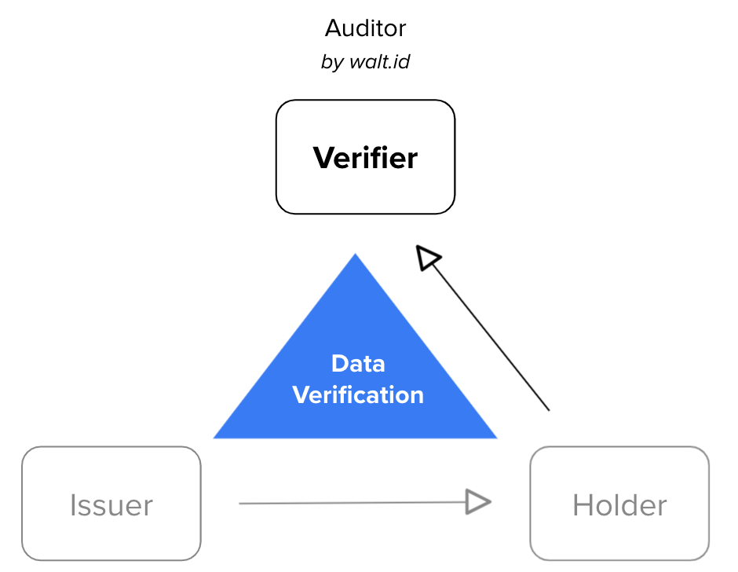

# SSI Kit

The **SSI Kit** is an open source product that enables Self-Sovereign Identity (SSI) in any application.

All components are written in **Kotlin/Java** and can directly be tied in JVM-based applications.

Alternatively all functions can be accesses over the **RESTfull webservice interface**, making integration with other languages and deployment scenarios straigtforward.

\--

Before diving into the details of the SSI Kit, here some of the principles that guide our product development:

* **Open Source**: Our products are open source under the permissive Apache 2 license, which means that anyone can use them free of charge.
* **Holistic Solutions**: We offer holistic solutions that are easy to use for organisations and individuals enabling them to act as Holders, Issuers and Verifiers.
* **Standard Compliance**: Our products are compliant with emerging SSI standards both on a global level (W3C, Decentralized Identity Foundation) and on a European level (EU Blockchain Service Infrastructure (EBSI), EU Self-Sovereign Identity Framework (ESSIF)).
* **Openness**: Our products are based on an open architecture that implements standardised interfaces which allow anyone to plug in third party solutions (from secure key or data stores to other SSI solutions) to prevent lock-in and ensure high flexibility.
* **Integrability**: Our products are programmed in Kotlin/Java and can be integrated via native SDKs and REST APIs as well as tested manually via an interface (CLI).

## What is the SSI Kit?

The SSI Kit bundles our products (“Signatory” for Issuers, “Custodian” for Holders, “Auditor” for Verifiers) in a unified solution that enables developers and organisations to use Self-Sovereign Identity (SSI) with ease.

The SSI Kit is a set of libraries that anyone can use to establish an identity infrastructure layer to power complex, low-level SSI operations for potentially any use case in any industry. In short, it enables all functionality required to use SSI, such as:

* Interactions with Registries which can be based on different technologies like the European Blockchain “EBSI”.
* Decentralised Identifiers (DIDs) and Keys, including generation, signing, anchoring, resolution and lifecycle management.
* Verifiable Credentials (VCs) and Verifiable Presentations (VP), including singing, issuance, verification, lifecycle management.
* Data exchange based on different protocols, including the exchange of VCs and VPs.

_Illustration:_

## Functional overview

The Walt.ID SSI Kit is a holistic SSI solution, with primarily focus on the European EBSI/ESSIF ecosystem.

The core services are in the scope of:

* **Key Management** generation, import/export
* **Decentralized Identifier (DID)** operations (register, update, deactivate)
* **Verifiable Credential (VC)** operations (issue, present, verify)
* **ESSIF/EBSI** related Use Cases (onboarding, VC exchange, etc.)

The ESSIF/EBSI functions are in the scope of:

* **Onboarding ESSIF/EBSI** onboarding a natural person/legal entity including the DID creation and registration
* **Enable Trusted Issuer** process for entitling a leagal entity to become a Trusted Issuer in the ESSIF ecosystem.
* **Credential Issuance** protocols and data formats for issuing W3C credentials from an Trusted Issuer to a natural person.
* **Credential Verification** verification facilities in order to determine the validity of a W3C verifiable credential aligned with ESSIF/EBSI standards

The library is written in **Kotlin/Java based library** and can be directly integrated as Maven/Gradle dependency. Alternatively the library or the additional **Docker container** can be run as RESTful webservice.

The **CLI tool** conveniently allows running all included functions manually.

### Signatory | For Issuers

Signatory allows you to digitise paper credentials and automate data provision to stakeholders.

This product enables your organisation to

* import identity-related data (from local storage or third-parties).
* create and sign / seal VCs.
* issue VCs to third parties.

In short, this product provides all functionality required by “Issuers”.

| One-Liner          |                                                                                                                                                                                                                                                                                                                               Issuer backend service for organisations (B2B). |
| ------------------ | ----------------------------------------------------------------------------------------------------------------------------------------------------------------------------------------------------------------------------------------------------------------------------------------------------------------------------------------------------------------------------: |
| Value              |                                                                                                                                               Replace paper documents with digital credentials to save money and improve citisen/customer experience. Automate data provision to ensure compliance (e.g. “right to access”). Give citizens/customers control over their data. |
| Main Functions     | Process and authenticate data requests by organisations or individuals (citisens, customers). Create VCs in different formats (e.g. JSON, JSON-LD). Use templates and import data from local storage. Sign VCs using different key types (e.g. ed25519, secp256K1, eIDAs). Manage the lifecycle of VCs (e.g. revocation). Issue VCs (via different protocols like OIDC/SIOP). |
| Deployment Options |                                                                                                                                                                                                                                                                                              On-Premise. Multi-Cloud (self-managed). Multi-Cloud (managed service by walt.id) |

### Custodian | For Holders

Custodian is a secure data hub for organisations and individuals.

This product enables your organisation, employees, customers or citisens to

* request import data (VCs) from third parties.
* securely store data (VCs), keys and other secrets.
* manage data (VCs) and consent in a user-centric fashion.
* selectively disclose data (VCs/VPs) and revoke access.

In short, this product provides all functionality required by “Holders”.

| One-Liner          |                                                                                                                                                                                                                                                                                                                                                                                                                                                                                                        Wallet framework for organisations (B2B) and individuals (B2C). |
| ------------------ | ---------------------------------------------------------------------------------------------------------------------------------------------------------------------------------------------------------------------------------------------------------------------------------------------------------------------------------------------------------------------------------------------------------------------------------------------------------------------------------------------------------------------------------------------------------------------: |
| Value              |                                                                                                                                                                                                                                                                                                                       - Secure storage of keys, sensitive data and secrets without lock-in (full data portability). - Authentication and identification (with 1-click). - Digital signature service (incl. eIDAS compatibility). - Data and consent management (GDPR). |
| Main Functions     | Create, store, manage, import, export cryptographic keys (e.g. ed25519, secp256k1, eIDAS), personal data or other secrets. Create, store, manage, import, export DIDs and DID Documents. Anchor (write), resolve (look up) and manage the lifecycle of DIDs and DID Documents. Request, store and manage VCs and VPs. Interact with DLTs to anchor or resolve information (e.g. information about legal entities, DIDs, keys, proofs, ...). Authenticate via DIDs, keys or VCs/VPs. Identify/prove attributes via VCs/VPs. Enable other products (Signatory, Auditor). |
| Deployment Options |                                                                                                                                                                                                                                                                                                                                                                                                                                                                                       On-Premise. Multi-Cloud (self-managed). Multi-Cloud (managed service by walt.id) |
| Wallet Options     |                                                                                                                                                                                                                                                                                                                                                                                               Cloud wallet (multi-cloud, on-prem). Custodial wallet (organisations can offer a wallet "as a service" to their citizens/customers). Mobile app (starting with Android). |

### Auditor | For Verifiers

Auditor allows you to verify your customers’ or citisens’ identity data and offer frictionless access to services or products.

This product enables your organisation to

* request data (VCs/VPs) from customers, citisens or other stakeholders.
* verify such data (VCs/VPs) incl. integrity, validity, provenance, authenticity.
* trigger pre-defined actions following the verification.
* In short, this product provides all functionality required by “Verifiers”.

| One-Liner                                                                                                |                                                                                                                                                                                                                                                                      Verifier backend service for organisations (B2B). |
| -------------------------------------------------------------------------------------------------------- | ---------------------------------------------------------------------------------------------------------------------------------------------------------------------------------------------------------------------------------------------------------------------------------------------------------------------: |
| Value                                                                                                    | Improve citisen/customer experiences by offering them seamless access to services (SSI-based authentication and identification). Get reliable data signed by data sources (41% of customers provide false data due to security and privacy concerns; RSA). Verify citizen/customer data in a privacy-friendly fashion. |
| Reduce help desk requests (e.g. related to passwords). Prevent data breaches (e.g. eliminate passwords). |                                                                                                                                                                                                                                                                                                                        |
| Deployment Options                                                                                       |                                                                                                                                                                                                                                       On-Premise. Multi-Cloud (self-managed). Multi-Cloud (managed service by walt.id) |
