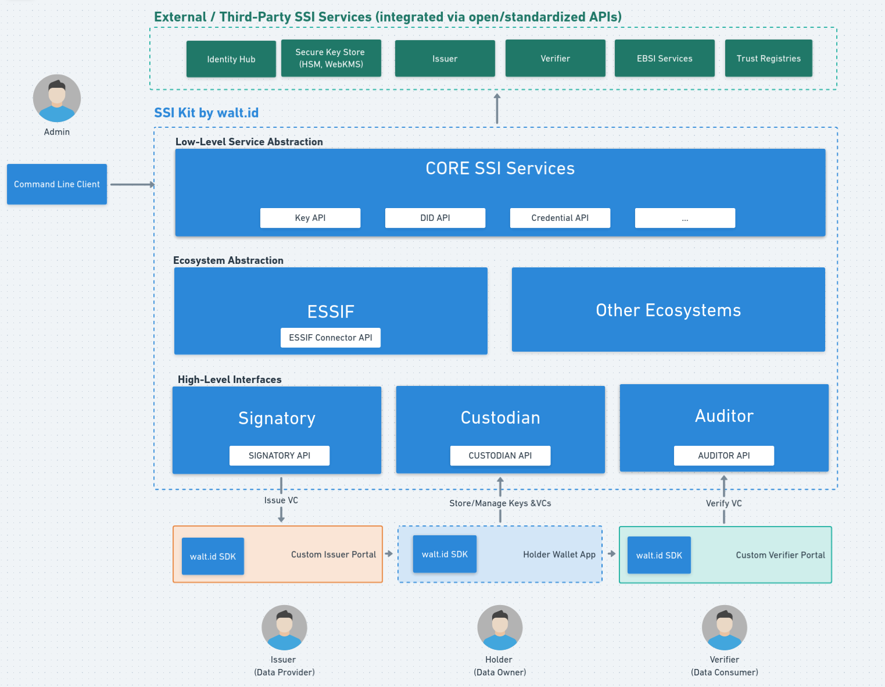

# Architecture

The architecture of the SSI Kit consists of **three layers**:

1. **Low-Level Services Abstraction**: Abstracts complex, low-level operations (e.g. cryptography, key management, digital signatures, data storage).
2. **Ecosystem Abstraction**: Abstracts ecosystem-specific requirements based on the relevant technical and governance frameworks (e.g. SSI flavors, business logic, policies).
3. **High-Level Interfaces / APIs**: Provides high-level interfaces that hide complexity and facilitate usage for developers.

Also, the architecture allows for the **integration of  third party solutions throughout the stack**. For example:

* Key storage (e.g. HSM, WebKMS)
* Data storage (e.g. identity hubs, confidential storage)
* Registries (e.g. blockchains, DNS)

This architectural openness prevents vendor lock-in and allows you to build SSI-based solutions that meet your unique requirements.

_Illustration:_

Read on to explore all three abstraction layers in more detail.
